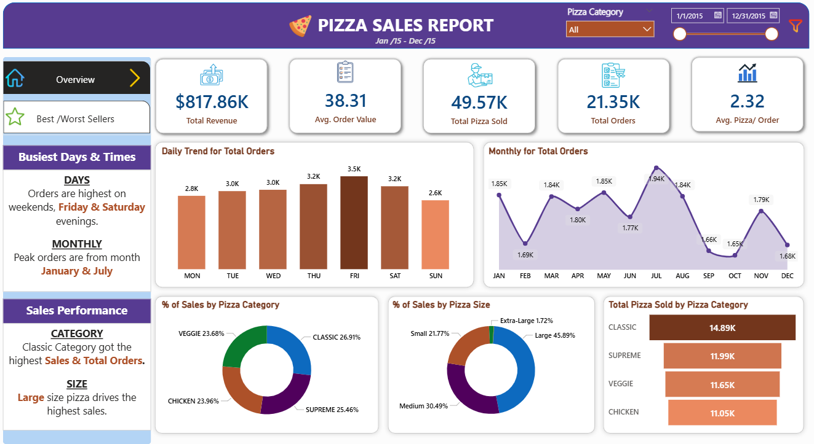
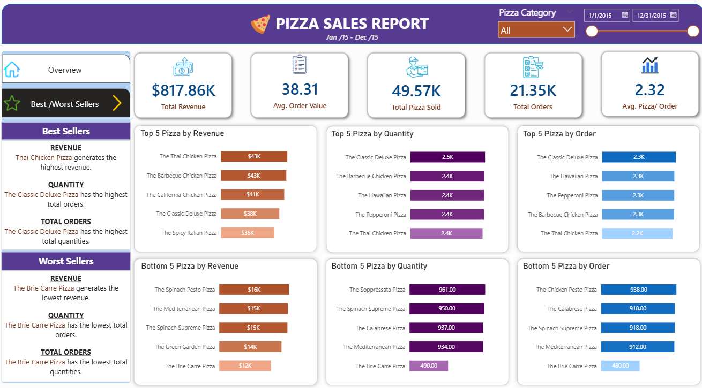
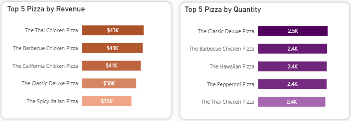
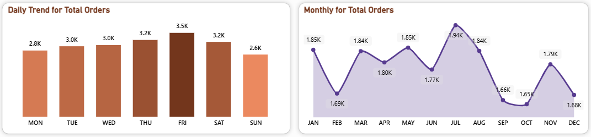
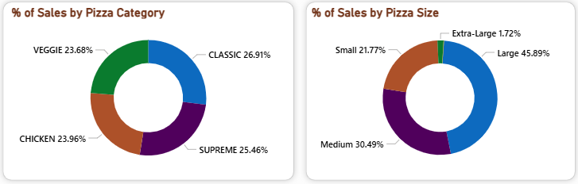
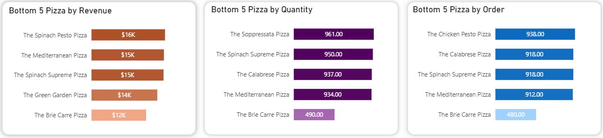

# Project Background & Overview
The pizza industry is highly competitive, and understanding sales patterns is key to maximizing profit. This project analyzes a full year of pizza sales data (January to December 2015) for a restaurant. By tracking total revenue, order trends, and popular pizza types, the management can optimize their menu, manage ingredients better, and identify the best times to run promotions.

**Key Business Questions:**
* What is our total revenue, and what is the average value of each customer's order?
* Which days of the week and months of the year see the highest order volume?
* Which pizza sizes and categories (Classic, Supreme, etc.) are the most popular among customers?
* Which pizzas are the "Best Sellers" that we must always have in stock, and which are the "Worst Sellers" that might need to be removed?

# Data Structure Overview
The data is structured to capture every single transaction throughout the year.

* **Source:** Kaggle Public Dataset
* **Sales Data:** Order ID, Quantity, and Revenue.
* **Product Data:** Pizza Name, Category (Veggie, Chicken, etc.), and Size (Small, Medium, Large, XL).
* **Time Data:** Date and Time of order (used for Daily/Monthly trends).

**Entity Relationship Diagram (ERD):**

# Executive Summary
In 2015, the restaurant generated **$817.86K in Total Revenue** from **21.35K orders**. On average, each order contains **2.32 pizzas** with a value of **$38.31**. The **Classic** category is the top performer in volume, while **Large** pizzas drive the most sales by size. While weekends (Friday/Saturday) are the busiest, there is a significant opportunity to improve sales for underperforming items like the **Brie Carre Pizza**.

**High-Level Metrics**
* **Total Revenue**: $817,860
* **Average Order Value**: $38.31
* **Total Pizzas Sold**: 49,570
* **Total Orders**: 21,350
* **Average Pizzas Per Order**: 2.32

**Overview**

**Best/Worst Sellers**

# Insights Deep Dive
### Revenue Leaders: Thai Chicken and Classic Deluxe
* The **Thai Chicken Pizza** generates the highest revenue ($43K), while the **Classic Deluxe** leads in total quantity (2.5K pizzas) and total orders.
* Even though Classic Deluxe sells more often, Thai Chicken is a higher-margin item that contributes more to the bottom line per sale.

### Temporal Peaks: Friday Nights and Summer/Winter Spikes
  * Orders are highest on **Friday** and **Saturday** evenings. Monthly, the peaks occur in **January** and **July**.
  * July is likely a peak due to summer holidays, and January due to New Year events. Sundays are the slowest days of the week.

### Size and Category Preferences: Large and Classic
* **Large** pizzas account for nearly **46%** of all sales. The **Classic** category is the most popular, followed by Supreme and Veggie.
* Customers prefer the value and size of "Large" pizzas across all categories. Extra-Large (XL) and XXL make up less than 2% of sales.
  

### The Bottom Performers: The Brie Carre Issue
* The **Brie Carre Pizza** is the worst seller across all metrics (Revenue, Quantity, and Orders).
* This pizza only generated $12K compared to the top seller's $43K. It is likely a niche flavor that does not appeal to the general customer base.

# Recommendations
* **Inventory Focus**: Ensure maximum stock of **Classic Deluxe** ingredients on **Fridays and Saturdays** to prevent stockouts during peak hours.
* **Menu Optimization**: Consider removing or rebranding the **Brie Carre Pizza**, as it has the lowest demand and lowest revenue.
* **Promotional Strategy**: Launch "Bundle Deals" on Sundays (the slowest day) to increase the average order value and utilize kitchen capacity.
* **Upselling Size**: Since **Large** is the favorite, create a "Combo Upgrade" to move customers from Medium to Large for a small price increase to boost revenue.
