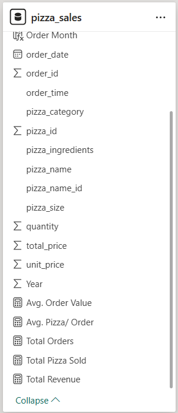

# Project Background & Overview
The pizza industry is highly competitive, and understanding sales patterns is key to maximizing profit. This project analyzes a full year of pizza sales data (January to December 2015) for a restaurant. By tracking total revenue, order trends, and popular pizza types, the management can optimize their menu, manage ingredients better, and identify the best times to run promotions.

**Key Business Questions:**
* What is our total revenue, and what is the average value of each customer's order?
* Which days of the week and months of the year see the highest order volume?
* Which pizza sizes and categories (Classic, Supreme, etc.) are the most popular among customers?
* Which pizzas are the "Best Sellers" that we must always have in stock, and which are the "Worst Sellers" that might need to be removed?

# Data Structure Overview
The data is structured to capture every single transaction throughout the year.

* **Source:** Kaggle Public Dataset
* **Sales Data:** Order ID, Quantity, and Revenue.
* **Product Data:** Pizza Name, Category (Veggie, Chicken, etc.), and Size (Small, Medium, Large, XL).
* **Time Data:** Date and Time of order (used for Daily/Monthly trends).

**Entity Relationship Diagram (ERD):**

# Executive Summary
In 2015, the restaurant generated **$817.86K in Total Revenue** from **21.35K orders**. On average, each order contains **2.32 pizzas** with a value of **$38.31**. The **Classic** category is the top performer in volume, while **Large** pizzas drive the most sales by size. While weekends (Friday/Saturday) are the busiest, there is a significant opportunity to improve sales for underperforming items like the **Brie Carre Pizza**.

**High-Level Metrics**
* **Total Revenue**: $817,860
* **Average Order Value**: $38.31
* **Total Pizzas Sold**: 49,570
* **Total Orders**: 21,350
* **Average Pizzas Per Order**: 2.32

**Overview**

# Insights Deep Dive
### Department Analysis: R&D as the Primary Attrition Driver
* The R&D department has the highest attrition with **133** employees leaving, followed by Sales (**92**).
* R&D represents more than half of the total company turnover. HR needs to investigate if this is due to high-pressure environments or uncompetitive pay in technical roles.

### Age Group Analysis: High Turnover in Young Professionals
  * The **25–34** age group has the highest number of departures (**112 employees**).
  * This group makes up nearly **47%** of total attrition. Younger employees are likely leaving for better career growth opportunities elsewhere.

### Education Analysis: Life Sciences and Medical Fields
* Employees with Life Sciences (**89**) and Medical (**63**) backgrounds are the most likely to leave.
* There is a high demand for these skills in the market. The company may be losing specialized talent to competitors.
  

### Role & Satisfaction: Low Ratings in Laboratory and Sales
* Laboratory Technicians and Sales Executives have some of the highest counts of "Level 1" (lowest) satisfaction scores.
* These roles are high-stress. The data shows **56** Lab Techs gave the lowest satisfaction rating, which correlates with high attrition in the R&D department.

# Recommendations
* **R&D Retention Program**: Conduct "Stay Interviews" in the R&D department to understand why 56% of departures are happening there.
* **Career Pathing for 25–34 Year Olds**: Since this group leaves the most, implement a clear 2-year promotion track to keep them engaged.
* **Role-Specific Support**: Improve the working conditions for Laboratory Technicians and Sales Executives to raise their job satisfaction scores from Level 1 to Level 3.
